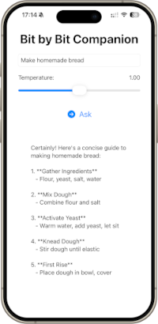

# 🔩 BitByBit – A Step-by-Step Task Companion Powered by Apple Foundation Models

BitByBit is a simple SwiftUI app that demonstrates how to use the new [`FoundationModels`](https://developer.apple.com/documentation/foundationmodels) framework introduced with Apple Intelligence. The app breaks down a task like “making homemade bread” into a list of short, actionable steps — all generated on-device using Apple’s system language model.



---

## 🛠 Features

- ✅ Utilizes on-device Foundation Models for natural language generation
- 💬 Accepts user input to generate task breakdowns
- 🌡 Adjustable temperature setting for controlling creativity of responses
- ⚙️ Checks model availability and handles fallback scenarios gracefully
- 📱 Clean, native SwiftUI interface with loading indicators

---

## 📦 Requirements

- Xcode 26 beta 2\
  [Download from Apple Developer](https://developer.apple.com/download/)
- iOS 18 (device with Apple Intelligence enabled)
- Swift Concurrency support (`async/await`)

> ⚠️ Note: Apple Intelligence may take time to download the model. It may not be available in Low Power Mode or if the device is too warm.

---

## 🚀 Getting Started

1. Clone the repository:

   ```bash
   git clone https://github.com/yourusername/BitByBit.git
   cd BitByBit
   ```

2. Open `BitByBit.xcodeproj` in Xcode 26 beta 2.

3. Build and run the app on a physical device with iOS 18 and Apple Intelligence enabled.

---

## 📂 Project Structure

```text
BitByBit/
├── ContentView.swift        # Model availability check and entry point
├── TaskView.swift           # Main UI where user types task and sees result
└── PromptManager.swift      # Async model interaction logic
```

---

## 🎛 Temperature Setting Explained

The **temperature slider** adjusts how creative or deterministic the model's responses are:

- Low values (e.g., 0.3): More stable and predictable
- High values (e.g., 1.5): More diverse and imaginative

---

## 🧪 Prompt Tuning Playground (Optional)

To experiment with the prompt without recompiling the app, create a Swift Playground file:

```swift
import Playgrounds
import FoundationModels

#Playground {
    let session = LanguageModelSession(
        instructions: """
        Suggest a maximum of ten main steps to the topic provided to complete the task. Keep them concise (three to seven words) and make sure they build naturally from the person's topic.
        """
    )

    let prompt = "Making homemade bread"
    let options = GenerationOptions(temperature: 1.0)

    let response = try await session.respond(to: prompt, options: options)
}
```

Use the canvas to view results instantly and fine-tune the prompt.

---

## ✅ What You Have Learned

In this code-along, you’ve learned how to:

- 💡 Access Apple’s Foundation Models using `SystemLanguageModel.default`
- 🧠 Check model availability and respond with fallback UI
- 🧵 Use Swift Concurrency (`async/await`) in a SwiftUI context
- ✨ Customize prompts with specific instructions to guide the model
- 🌬 Adjust the temperature to explore creative vs. stable output
- 🚨 Handle async UI updates using `Task {}` safely
- 🛠 Build a reusable `PromptManager` to encapsulate model interactions
- 🧪 Use Playgrounds to iterate on prompts quickly

---

## License

This project is licensed under the MIT License. See the LICENSE file for details.

---

Happy coding!

Let your curiosity guide you — and unlock new skills with Swift. ✨

---

## 👩‍💻 About the Creator

This project is part of the [swiftandcurious](https://swiftandcurious.com) initiative — inspiring and empowering self-taught developers to explore Swift, step by step.

Created by [Karina Schreiber](https://swiftandcurious.com), a hobby app developer and curious mind.

Follow along on [X/Twitter](https://twitter.com/swiftandcurious) for more SwiftUI tutorials and code-alongs!

